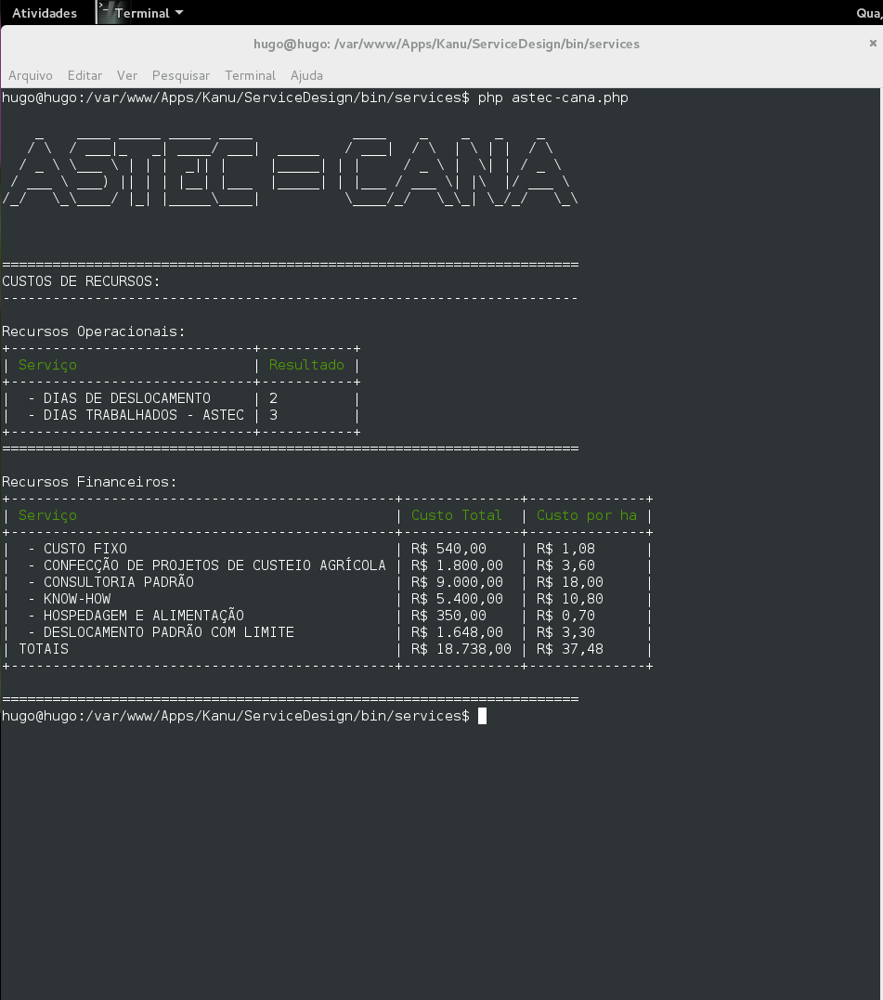
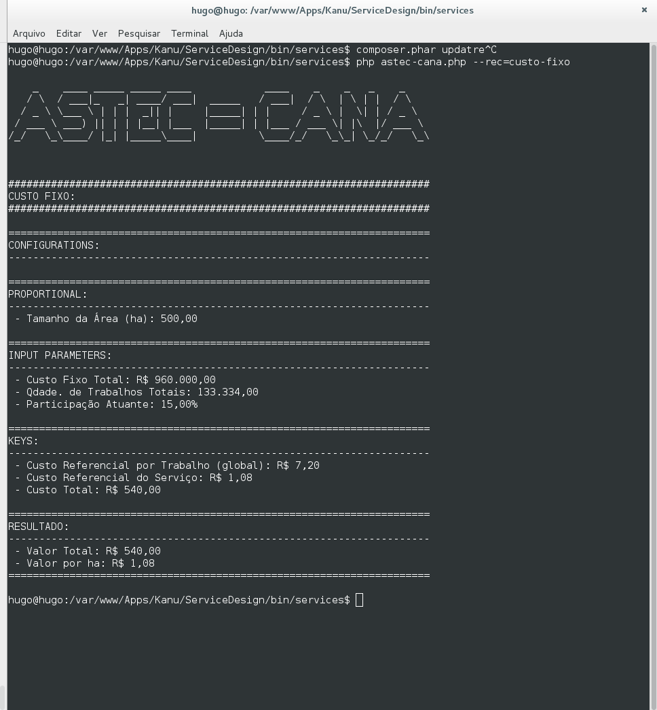

aptitude install figlet

Separar manipulação de valor e manipulação de máscara

Deve-se ter suporta a múltiplas manipulações de valor obedecendo uma sequência.

Talvez tenha de suportar parâmetros informativos: para report de serviço e recurso.

Arquitetura atual deve suportar a chamada de um recurso múltiplas vezes.

# INTERFACE CLI

### TELA 1 - Calculando Custo de Serviço

### TELA 2 - Detalhamento de Recurso
